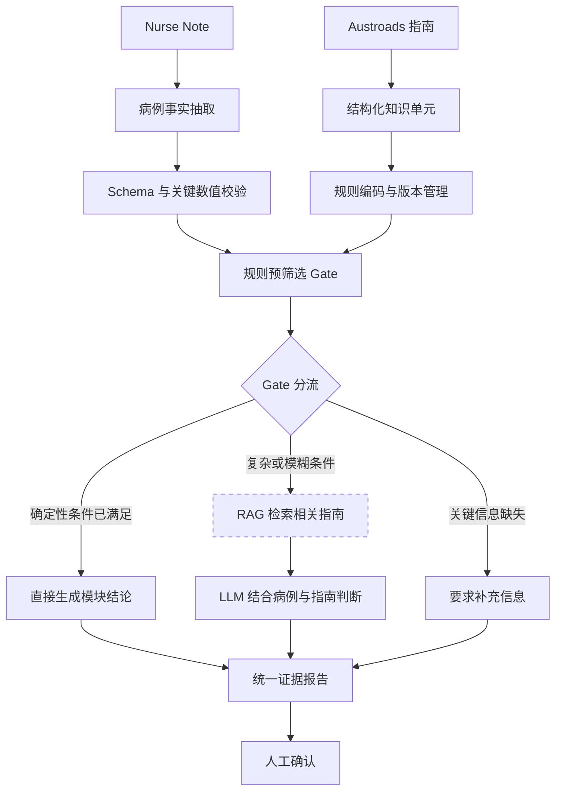

# Austroads 确定性评估模块结构与接口汇报

## 1. 我负责的范围

我负责除 RAG 检索与证据返回之外的完整确定性评估流程：

1. 将 Austroads 指南整理为带章节、页码和原文的结构化知识单元；
2. 将可确定执行的标准编码成版本化规则；
3. 接收护士病例文本并提取结构化事实；
4. 将指标拆分到 Vision、Hearing、Blood Pressure、Blackout、Diabetes 等类别；
5. 通过 Gate 检查必需事实和规则适用条件；
6. 执行确定性规则并生成结构化评估结论；
7. 输出标准化的 `rule_result.json`；
8. 将需要指南证据的规则结果提供给 RAG，但不负责向量索引、检索、排序和 `evidence_pack.json`。

当前范围仅为 Austroads commercial-driver assessment，不代表所有职业健康评估。

### 1.1 第一版已经确认的五个模块

1. Hypertension（高血压）；
2. Vision（视力）；
3. Hearing（听力）；
4. Blackout（意识丧失）；
5. Diabetes（糖尿病）。

第一版心血管范围只实现 Hypertension，不扩展到全部心血管疾病。护士记录中虽然出现 MI、PCI、stent、胸痛和呼吸困难，这些字段可以先抽取和保存，但在第一版中应路由到人工审核，不能假设完整 CVD 规则已经实现。

### 1.2 我的工程交付范围

- 建立代码仓库和开发环境；
- 确定并记录技术栈；
- 部署本地 LLM 服务；
- 建立基础数据库结构；
- 建立 Nurse note 输入接口；
- 建立结构化 JSON 输出接口；
- 整理五个模块对应的指南章节、表格和 commercial standards；
- 建立结构化指南知识单元和确定性规则；
- 实现事实抽取、Gate、规则执行、五类结果和缺失信息请求；
- 接收 RAG 返回的证据并汇总为统一报告；
- 保留人工确认步骤。

### 1.3 不在我的实现范围

- 文档切块和 embedding；
- 向量数据库检索逻辑；
- metadata filter 和相似度排序；
- RAG top-k 证据选择；
- `evidence_pack.json` 的检索模块实现。

RAG 模块由另一位开发者实现，但我负责定义其输入接口、接收其输出，并完成整个工作流的集成。

## 2. 模块结构



### 2.1 建议代码结构

```text
src/
├── schemas.py             # 病例、指标和结果的数据模型
├── guideline_parser.py    # 将指南条目整理为结构化知识单元
├── knowledge_validator.py # 校验章节、页码、原文和交叉引用
├── preprocess.py          # 文本清理与缩写标准化
├── extract_case.py        # 使用本地 LLM 提取事实
├── numeric_fallback.py    # 校验 BP、HR、视力和听力数值
├── map_categories.py      # 映射至首版五个模块
├── rule_loader.py         # 加载并验证 Austroads YAML 规则
├── rule_engine.py         # Red Flag、缺失信息及路由判断
├── rag_client.py          # 调用外部 RAG 接口，不实现检索
├── report_builder.py      # 汇总规则结论、RAG 证据及缺失信息
├── audit.py               # 保存输入、模型和规则版本
└── pipeline.py            # 串联完整流程

rules/
└── austroads_commercial_v1.yaml

knowledge/
├── cardiovascular.json
├── vision.json
├── hearing.json
├── blackout.json
└── diabetes.json

db/
├── models.py              # 病例、运行记录、规则版本和结果表
└── migrations/

api/
├── routes_cases.py        # Nurse note 输入接口
└── routes_results.py      # JSON 结果查询接口

config/
├── app.yaml
└── local_llm.yaml

tests/
├── test_extraction.py
├── test_mapping.py
├── test_rules.py
├── test_pipeline.py
└── expected_results/
```

### 2.2 四个处理阶段

#### 阶段一：指南结构化与规则编码

把指南中的每项 commercial standard 保存为可追溯知识单元，例如：

```json
{
  "source_id": "AFTD2022-HTN-COM-001",
  "condition": "hypertension",
  "standard": "commercial",
  "criterion_type": "unconditional",
  "section": "2.3",
  "printed_page": 88,
  "pdf_page": 99,
  "table_row": "Hypertension",
  "source_text": "...",
  "cross_references": []
}
```

然后将可确定执行的标准编码为规则：

```json
{
  "rule_id": "HTN-COM-001",
  "required_facts": [
    "persistent_systolic_bp",
    "persistent_diastolic_bp"
  ],
  "logic": "SBP > 170 OR DBP > 100",
  "result": "unconditional_standard_not_met",
  "source_id": "AFTD2022-HTN-COM-001"
}
```

#### 阶段二：结构化事实提取

从 nurse note 中提取：

- 病例编号、年龄、性别和岗位；
- `framework = Austroads`；
- `licence_context = commercial`；
- CVD/Blood Pressure：血压、心率、症状、MI/PCI/stent 病史和专科报告；
- Vision：裸眼/矫正视力、眼镜、复视、视野和专科报告；
- Hearing：听损侧别、助听器、audiometry、dB 数值和专科报告；
- Blackout：意识丧失类型、诱因、日期、复发和无发作时间；
- Diabetes：类型、治疗方式、低血糖事件、监测和并发症；
- 每项事实对应的原始文本；
- 无法提取、未记录或内容冲突的字段。

LLM 只负责提取事实，不负责决定是否触发 Red Flag。血压、心率、视力和 dB 等关键数值需要确定性校验。

#### 阶段三：Gate 与确定性规则检查

Python 规则引擎根据版本化的 Austroads YAML 规则执行：

- 必需字段检查；
- 数值阈值检查；
- 症状和病史条件检查；
- 专科报告或检查资料是否缺失；
- Red Flag 严重程度和路由计算。

Gate 先判断某条规则需要的事实是否齐全；事实不足时不执行阈值结论，而是转入人工审核。最终输出必须区分五类：

| 结果代码 | 展示文本 | 含义 |
|---|---|---|
| `meets_unconditional_standard` | Meets unconditional standard | 已检查的规则表明满足无条件标准 |
| `may_meet_conditional_standard` | May meet conditional standard | 不满足无条件标准，但指南允许在额外条件下考虑 conditional licence |
| `temporarily_unfit` | Temporarily unfit | 指南规定当前阶段应暂时停止驾驶或等待规定期限 |
| `does_not_meet_standard` | Does not meet standard | 明确不满足适用标准，且当前规则没有可直接采用的 conditional 路径 |
| `insufficient_information` | Insufficient information / Human review required | 必需事实、检查或报告不足，或规则不能安全自动执行 |

未记录、无法提取和明确阴性必须分开。病例没有提到某个症状时，不能自动等同于“没有该症状”。

#### 阶段四：Result 接口输出

本模块直接生成结构化评估结论并输出 `rule_result.json`。RAG 模块可以使用规则标识和 `source_id` 检索补充证据，但不能改变确定性结论。

## 3. 最终 Result 接口

### 3.1 完整示例

```json
{
  "schema_version": "1.0.0",
  "case_id": "SYN-M2-006",
  "source": {
    "type": "nurse_note",
    "source_file": "SYN-M2-006.txt"
  },
  "assessment_context": {
    "framework": "Austroads",
    "licence_context": "commercial",
    "job_title": "delivery driver"
  },
  "ruleset": {
    "ruleset_id": "austroads-commercial",
    "ruleset_version": "draft-v1",
    "guideline_version": "AP-G56-22"
  },
  "route": "review_path",
  "assessment_outcome": "temporarily_unfit",
  "outcome_label": "Temporarily unfit",
  "triggered_rules": [
    {
      "rule_id": "IHD-COM-SYMPTOM-001",
      "source_id": "AFTD2022-IHD-COM-001",
      "category": "cardiovascular",
      "subcondition": "possible_ischaemic_symptoms",
      "reason": "Recent exertional chest pain and shortness of breath were recorded.",
      "observed_facts": {
        "exertional_chest_pain": true,
        "dyspnoea": true
      },
      "source_evidence": [
        "Reports intermittent exertional chest pain and shortness of breath over the past two weeks"
      ],
      "rag_query_key": "ischaemic_heart_disease_commercial"
    }
  ],
  "missing_information": [],
  "rules_evaluated": [
    {
      "rule_id": "IHD-COM-SYMPTOM-001",
      "result": "triggered"
    }
  ],
  "processing_warnings": [],
  "requires_human_review": true
}
```

示例中的结论仍需与指南原文及项目的状态映射规则核对；它展示的是接口形状，不是最终驾驶许可决定。

### 3.2 顶层参数

| 参数 | 类型 | 必需 | 说明 |
|---|---|---:|---|
| `schema_version` | string | 是 | Result 接口版本 |
| `case_id` | string | 是 | 病例唯一编号 |
| `source` | object | 是 | 输入来源和源文件信息 |
| `assessment_context` | object | 是 | 评估框架、驾照场景和岗位 |
| `ruleset` | object | 是 | 本次运行使用的规则版本 |
| `route` | enum | 是 | `fast_path` 或 `review_path` |
| `assessment_outcome` | enum | 是 | 五类结构化评估结论之一 |
| `outcome_label` | string | 是 | 面向界面和报告的英文结论名称 |
| `triggered_rules` | array | 是 | 所有被触发的规则；没有时为空数组 |
| `missing_information` | array | 是 | 缺失的必要资料；没有时为空数组 |
| `rules_evaluated` | array | 建议 | 已执行的规则及结果，供审计使用 |
| `processing_warnings` | array | 是 | 抽取冲突、非法值或处理警告 |
| `requires_human_review` | boolean | 是 | 是否必须由医生或临床人员审核 |

### 3.3 `source` 参数

| 参数 | 类型 | 必需 | 说明 |
|---|---|---:|---|
| `type` | enum | 是 | 当前为 `nurse_note` |
| `source_file` | string | 是 | 原始输入文件名，不包含文件内容 |

### 3.4 `assessment_context` 参数

| 参数 | 类型 | 必需 | 说明 |
|---|---|---:|---|
| `framework` | enum | 是 | 当前固定为 `Austroads` |
| `licence_context` | enum | 是 | 当前 prototype 固定为 `commercial` |
| `job_title` | string/null | 建议 | 原始岗位，例如 `bus driver` |

岗位只用于记录和报告，实际规则由 `framework` 和 `licence_context` 决定。

### 3.5 `ruleset` 参数

| 参数 | 类型 | 必需 | 说明 |
|---|---|---:|---|
| `ruleset_id` | string | 是 | 规则包唯一标识 |
| `ruleset_version` | string | 是 | 实际执行的规则版本 |
| `guideline_version` | string | 是 | 对应的 Austroads 指南版本 |

### 3.6 `triggered_rules[]` 参数

| 参数 | 类型 | 必需 | 说明 |
|---|---|---:|---|
| `rule_id` | string | 是 | 稳定且唯一的规则编号 |
| `source_id` | string | 是 | 对应的指南结构化知识单元 ID |
| `category` | enum | 是 | 当前包括 `cardiovascular`、`vision`、`hearing`、`blackout`、`diabetes`；Blood Pressure 可作为 cardiovascular 子类 |
| `subcondition` | string | 是 | 更具体的规则和检索主题 |
| `reason` | string | 是 | 面向审核人员的简短触发原因 |
| `observed_facts` | object | 是 | 实际触发规则的结构化指标和值 |
| `source_evidence` | string[] | 是 | 支持该结果的 nurse note 原文片段 |
| `rag_query_key` | string | 是 | RAG 构造受控检索的稳定键 |

### 3.7 `missing_information[]` 参数

```json
{
  "field": "cardiovascular.blood_pressure.repeat_measurement",
  "category": "cardiovascular",
  "reason": "A repeat blood-pressure measurement is required but unavailable.",
  "required_by_rule_id": "CVD_BP_TBC",
  "rag_query_key": "hypertension_required_assessment_commercial"
}
```

| 参数 | 类型 | 必需 | 说明 |
|---|---|---:|---|
| `field` | string | 是 | 缺失字段的完整路径 |
| `category` | enum | 是 | 所属临床类别 |
| `reason` | string | 是 | 为什么该资料是判断所必需的 |
| `required_by_rule_id` | string | 是 | 要求该字段的规则 |
| `rag_query_key` | string/null | 待确认 | 是否需要 RAG 检索补充要求 |

### 3.8 接口约束

- `triggered_rules` 和 `missing_information` 必须始终存在，即使为空；
- `assessment_outcome` 必须是五个允许值之一；
- `route = fast_path` 时，结论只能是 `meets_unconditional_standard`；
- 结论不是 `meets_unconditional_standard`，或存在解析冲突、关键资料缺失时，`requires_human_review` 必须为 `true`；
- 每条 triggered rule 必须包含 `rule_id`、`source_id`、结构化事实和病例原文证据；
- 所有字段名及枚举值应在与 RAG 联调前冻结版本；
- 未批准的规则必须标记为 draft/prototype，不得显示为正式临床结论。

## 4. 需要确认的问题

### 4.1 必须优先确认

1. Red Flag 的正式含义是什么：紧急临床风险、暂不适合驾驶，还是所有需要医生审核的情况？
2. 是否区分 `urgent_red_flag`、`red_flag`、`review_required` 和 `missing_information`？
3. 请团队确认：首版五个模块是否全部严格采用 AP-G56-22 的 commercial standards，并以指南章节、表格、页码和原文作为规则依据。
4. 当前没有临床负责人时，请确认规则的验收方式：由项目成员双人核对指南原文，还是将全部规则保持 `prototype/unverified`，等待后续专业审核。
5. RAG 团队是否接受本文的 `rule_result.json` 字段和枚举值？
6. 一个病例出现多个 flags 时，RAG 是分别检索还是合并检索？

### 4.2 临床规则需要确认

7. 请团队确认首版五个模块采用统一原则：只编码 AP-G56-22 中可以确定执行的 commercial standard；涉及临床判断、复杂组合条件或资料不足时进入 RAG/人工审核，并为每条规则保存阈值、章节、页码和指南原文。

### 4.3 数据抽取需要确认

8. 现有 10 条 nurse notes 没有覆盖 Blackout 和 Diabetes，是否需要为这两个模块补充正常、异常、缺失和边界值测试病例？
9. `WNL` 或 `meets commercial driving standards` 是否可直接视为正常，还是必须标记为缺少具体数值？
10. 病例没有提及某症状时，保存为 `not_recorded`，还是可以视为阴性？
11. 输入是否始终为英文 TXT，未来是否包含 PDF、扫描件、表格或中文记录？
12. 本地 LLM 的具体模型和版本是什么？是否允许云端处理？
13. 当 LLM 与正则抽取结果冲突时，是否统一强制人工审核？

### 4.4 Result 接口需要确认

14. `assessment_outcome` 是否只保存最高优先级的一个结论；如果病例同时触发规则并缺少资料，是否通过 `triggered_rules` 和 `missing_information` 同时保留两个事实？
15. `review_path` 是否需要细分为紧急处置、普通审核和补充资料？
16. `missing_information` 是否也要提供 `rag_query_key`？
17. RAG 需要完整 `observed_facts`，还是只需要规则 ID、类别和子条件？
18. RAG 返回证据后，是否确定由本模块负责生成最终 doctor-facing report？
19. 最终系统接口使用 JSON 文件、CLI 还是 REST API？

## 5. 当前建议

在编写正式 Red Flag 判断代码前，优先完成：

1. 将 AP-G56-22 中五个模块的 commercial standards 做成带原文和页码的规则清单，并将状态标记为 `prototype/unverified`；
2. 与 RAG 开发者冻结 `rule_result.json` 和 `evidence_pack.json` 的接口边界；
3. 为现有 10 条病例建立 expected result，并补充 Blackout 和 Diabetes 测试病例；
4. 建立代码仓库、开发环境、本地 LLM 服务、基础数据库以及输入/输出接口。

以上事项确认前，可以开发结构化抽取、schema validation 和测试框架，但规则应保持 `draft` 或 `TBC` 状态。
