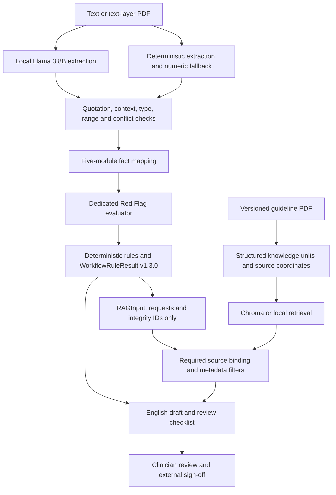

# System architecture

Software 0.4.0 uses `WorkflowRuleResult` 1.3.0 as its sole rule-result contract. Supporting artifacts are independently versioned. The platform supports occupational health providers, enterprise health teams and reviewing clinicians.

## Component responsibilities

| Component | Implementation | Output |
|---|---|---|
| Local extraction | Ollama and Llama 3 8B | Typed proposals with exact quotations |
| Fact validation | `case_intake/model_intake.py`, `traceable.py` | Structured case and extraction audit |
| Category mapping | Hypertension, vision, hearing, blackout, diabetes | Category-specific facts |
| Red Flag boundary | `red_flag.py`, executed before retrieval | Explicit Red Flag classification and validated rule result |
| Rules | Whitelisted predicates, applicability gates and three-valued logic | Rule result and routing |
| Evidence | Source-ID binding, commercial-context filters and optional ranking | Evidence pack |
| Reporting | Fixed English templates and separate unverified model commentary | HTML, Markdown and review JSON |

Model intake precedes rule execution. A proposal becomes an `llm_grounded` fact only when its quotation, context, field meaning, type and range pass validation. Conflicts remain explicit and missing facts remain unknown. Grounding coverage is limited to the implemented field semantics; this is not unrestricted medical-language understanding.

Default operation enables extraction and commentary. Commentary cannot overwrite rules or citations. Model failures retain deterministic facts and template reports with a recorded fallback status. Local transports bypass system proxies for loopback requests.

## Evidence chains

Case: input fingerprint → extracted text → quotation offsets, line numbers and PDF page → fact → rule evaluation tree.

Guideline: PDF fingerprint → source ID → section, printed/PDF pages, table row and bounding box → verified text → rule request → evidence pack → report.

Fast paths still bind required sources. Risk, complex conditions, missing information and conflicts route to appropriate evidence or human review. Retrieval cannot invent patient history. A rule that does not trigger is not itself proof of compliance.

Deterministic triggered rules use exact local source-ID binding and do not invoke
semantic RAG ranking. Unresolved Gate/predicate evaluations and rules that
deterministically identify a complex or insufficient-information review are
emitted as `missing_information_guidance` and may invoke ranked retrieval. RAG
supplies guidance evidence only; it never changes facts, rule outcomes or routes.

Deployment boundaries and unresolved institutional integrations are documented separately in [deployment](deployment.md).
