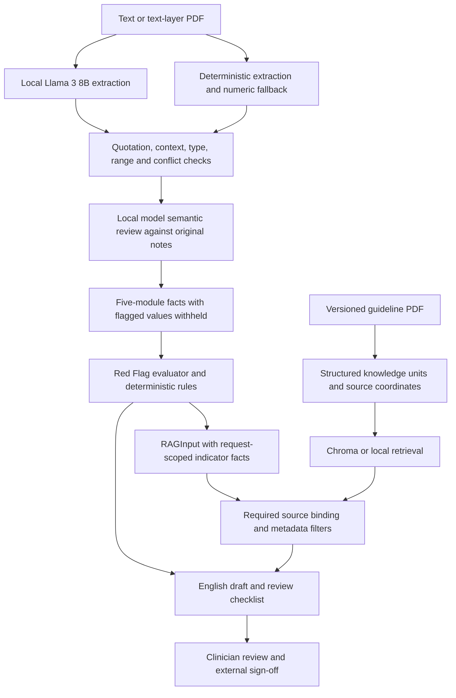

# System architecture

Software 0.7.1 uses WorkflowRuleResult 1.3.0 and RAGInput 1.1.0 (also accepts legacy 1.0.0 requests). Supporting assessment artifacts remain at 1.2.0; independent indicator contracts remain at 1.0.0. The platform supports occupational health providers, enterprise health teams and reviewing clinicians. The local workspace adds asynchronous intake and verified report access; see [Team integration](team_integration.md).

## Component responsibilities

| Component | Implementation | Output |
|---|---|---|
| Local extraction | Ollama and Llama 3 8B | Typed proposals with exact quotations |
| Fact validation | `case_intake/model_intake.py`, `traceable.py` | Structured case and extraction audit |
| Semantic review | `case_intake/semantic_review.py` | Source-bound concerns, quarantined facts and review audit |
| Category mapping | Hypertension, vision, hearing, blackout, diabetes | Category-specific facts |
| Red Flag boundary | `red_flag.py`, executed before retrieval | Explicit Red Flag classification and validated rule result |
| Rules | Whitelisted predicates, applicability gates and three-valued logic | Rule result and routing |
| Evidence | Source-ID binding, commercial-context filters and optional ranking | Evidence pack |
| Reporting | Fixed English templates and separate unverified model commentary | HTML, Markdown and review JSON |

Model intake precedes rule execution. A proposal becomes an `llm_grounded` fact only when its quotation, context, field meaning, type and range pass validation. Conflicts remain explicit and missing facts remain unknown. Grounding coverage is limited to the implemented field semantics; this is not unrestricted medical-language understanding.

Default operation enables extraction, second-pass semantic review and commentary. Review cannot insert replacement facts; concerns or an incomplete review route affected modules to human review. Commentary cannot overwrite rules or citations. Model failures retain validated facts and template reports with a recorded fallback status. Local transports bypass system proxies for loopback requests. See [Extraction semantic review](semantic_review.md) for review behavior and separate pre/post-retrieval experiments.

## Evidence chains

Case: input fingerprint → extracted text → quotation offsets, line numbers and PDF page → fact → rule evaluation tree.

Guideline: PDF fingerprint → source ID → section, printed/PDF pages, table row and bounding box → verified text → rule request → evidence pack → report.

Fast paths still bind required sources. Risk, complex conditions, missing information and conflicts route to appropriate evidence or human review. Retrieval cannot invent patient history. A rule that does not trigger is not itself proof of compliance.

Every request binds its required source IDs. Fast-path cases use exact binding without ranking. For non-fast cases, all requests use indicator-scoped hybrid ranking when a ranking backend is configured; an explicit `exact` backend remains available. Triggered rules retain `triggered_rule_evidence`; unresolved rules retain `missing_information_guidance`. Retrieval never changes facts, rule outcomes or routes.

The additional route-model experiment is disabled in every shipped configuration. Independent semantic review remains enabled in the normal local-model workflow. See [Framework preservation](framework_preservation.md).

Deployment boundaries and unresolved institutional integrations are documented separately in [deployment](deployment.md).
