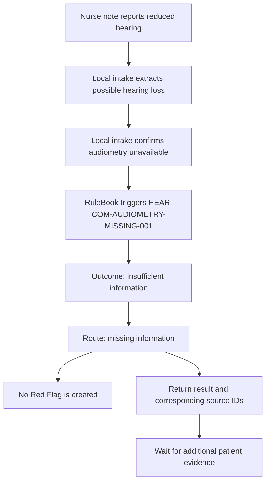
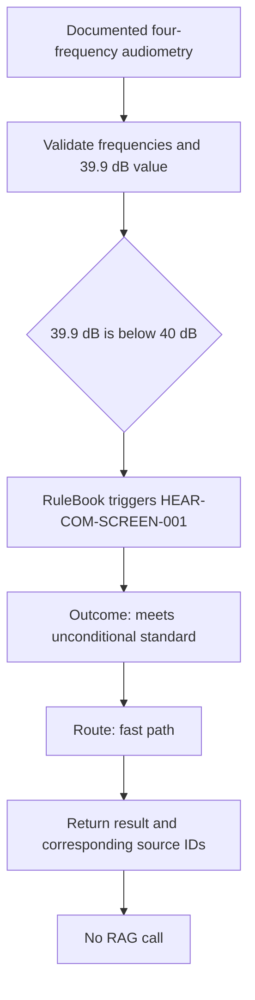
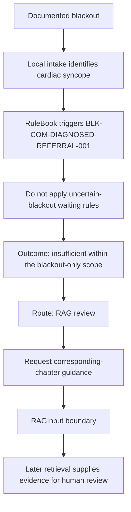

# Red Flag routing examples

This document describes the three minimum pre-RAG paths implemented by the
Occupational Fitness Platform. All examples call `POST /red-flag/evaluate` and
therefore stop at the pre-RAG boundary. Every response includes the structured
case, `WorkflowRuleResult`, a three-way `routing_category`, and concise
`relevant_sections` entries containing source ID, section, printed page and PDF
page. Only `rag_fusion` includes a `RAGInput`.
Retrieval does not decide or change the assessment.

## Involved files

| File | Responsibility |
|---|---|
| `src/occupational_fitness_rag/api.py` | Accepts the case text and `modules_requested`; exposes the Red Flag boundary. |
| `src/occupational_fitness_rag/pipeline/workflow.py` | Runs intake and Red Flag evaluation without invoking retrieval. |
| `src/occupational_fitness_rag/llm.py` | Uses local Ollama for grounded field proposals and constrained route advice. |
| `src/occupational_fitness_rag/rules/engine.py` | Evaluates gates and predicates, then preserves configured `fast_path`, `rag_review` or missing-information routing. |
| `src/occupational_fitness_rag/red_flag.py` | Converts the internal rule result to canonical `WorkflowRuleResult` v1.3.0. |
| `src/occupational_fitness_rag/schemas/red_flag_result.py` | Defines the public result and immutable `RAGInput`. |
| `configs/rules/austroads_commercial_v1.yaml` | Defines rule IDs, conditions, outcomes, source IDs and configured routes. |
| `tests/test_red_flag.py` | Protects Red Flag separation and the three routing behaviours. |

## Case 1: hearing evidence is missing

Important input fields:

```text
hearing.clinical_assessment = possible_hearing_loss
hearing.audiometry.available = false
```

Important output fields:

```text
assessment_outcome = insufficient_information
route = missing_information
has_red_flag = false
red_flags = []
missing_information = [hearing.average_frequencies_khz, hearing.unaided_better_ear_average_db]
rag request type = missing_information_guidance
API routing_category = needs_more_information
API rag_input = null
```



## Case 2: hearing evidence is sufficient for a local result

Important input fields:

```text
hearing.clinical_assessment = possible_hearing_loss
hearing.audiometry.available = true
hearing.average_frequencies_khz = [0.5, 1, 2, 3]
hearing.unaided_better_ear_average_db = 39.9
```

Important output fields:

```text
assessment_outcome = meets_unconditional_standard
route = fast_path
has_red_flag = false
red_flags = []
missing_information = []
triggered rule = HEAR-COM-SCREEN-001
rag request type = triggered_rule_evidence
API routing_category = local_result
API rag_input = null
```



The assessment is made locally. A later RAG stage may bind the configured
guideline sources, but it cannot revise the outcome.

## Case 3: diagnosed blackout requires cross-chapter guidance

Important input fields:

```text
blackout.occurred = true
blackout.mechanism_status = diagnosed
blackout.diagnosis = cardiac_syncope
```

Important output fields:

```text
assessment_outcome = insufficient_information
route = rag_review
has_red_flag = false
red_flags = []
missing_information = []
triggered rule = BLK-COM-DIAGNOSED-REFERRAL-001
rag request type = missing_information_guidance
API routing_category = rag_fusion
API rag_input = structured object
```



This case has no missing blackout fact. The limitation is cross-chapter scope,
so `rag_review` is preserved instead of incorrectly reporting
`missing_information`.

## Routing invariant

```text
unknown or unconfirmed required facts -> missing_information
fully determined local passing rule -> fast_path
fully determined complex or cross-chapter rule -> rag_review
processing conflict or explicit manual escalation -> human_review
```

`missing_information` never creates a Red Flag automatically. Red Flags remain
limited to triggered rules whose assessment outcomes are `temporarily_unfit`
or `does_not_meet_standard`.

## Local-model extraction boundary

In the standard `configs/workflow.yaml`, Ollama reads the original case note
only during intake and proposes dictionary fields. A proposal is accepted only
when it includes an exact quotation that passes field type and semantic
validation.

The local model does not select the processing route, decide the Red Flag, or
write the final clinical narrative. The deterministic rule engine owns those
decisions. The downstream RAG receives the completed rule result and retrieves
the source-bound guideline evidence without modifying the result.
